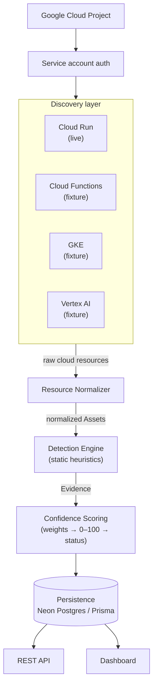
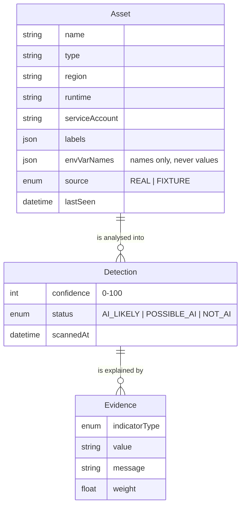
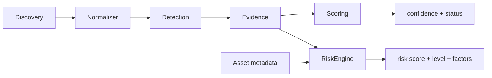
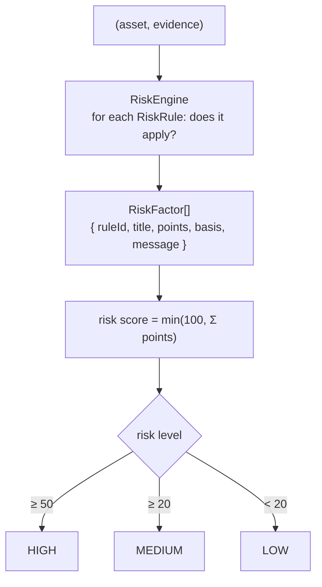

# Architecture

Shadow AI Discovery Engine scans a Google Cloud project, inventories cloud
workloads, identifies likely AI agents using explainable heuristics, and exposes
the results through a REST API and dashboard.

This document covers the system's structure, the domain model, the design
decisions and their rationale, the tradeoffs made, and what would change to run
this in production across thousands of projects.

---

## 1. System structure

The system is a **linear pipeline**: each layer has exactly one responsibility
and talks only to the adjacent layer.

### Layer responsibilities and boundaries

The boundaries are the point of the design - they are what keep the AI logic
separable from cloud I/O and from storage.

| Layer | Does | Never does |
| ----- | ---- | ---------- |
| **Discovery** | Collects raw cloud resources | No AI logic, no persistence |
| **Normalizer** | Reshapes provider payloads into `Asset`s | No AI logic, no I/O |
| **Detection** | Identifies AI indicators, emits `Evidence` | Never calls GCP; never scores; never persists |
| **Scoring** | Aggregates evidence into confidence + status | Never inspects the asset; never generates evidence |
| **Persistence** | Stores results, retrieves inventory | No business logic; no GCP or HTTP types |
| **API** | Orchestrates layers, exposes data | No business logic of its own |
| **Dashboard** | Renders persisted data | No detection or scoring math |

Concretely: `lib/detection` imports no GCP SDK, `lib/scoring` imports only the
`Detection`/`Evidence` types, and `lib/persistence` imports no `next/server`.
Those are the invariants the layering buys.

---

## 2. Domain model

Discovered infrastructure is modelled independently from AI analysis.

- **Asset** - a cloud resource (name, type, region, runtime, service account,
  labels, environment variable *names*, `source`, `lastSeen`).
- **Detection** - the outcome of analysing an asset (`confidence` 0–100,
  `status`, `scannedAt`).
- **Evidence** - one machine-readable indicator plus its human-readable reason
  and `weight`; the explanation behind a score.

`source` is provenance: `REAL` only when GCP actually returned the data,
`FIXTURE` for representative seed data. It is set at the discovery seam and never
overwritten downstream.

### How the score is computed

Detection emits weighted indicators; scoring sums them:

| Indicator | Weight | Example |
| --------- | -----: | ------- |
| `RUNTIME` | 0.9 | an observed Vertex `GenerateContent` call in Cloud Logging (Bonus 1) |
| `ENV_VAR` | 0.9 | `OPENAI_API_KEY`, `VECTOR_DB_URL` (a provider key is a strong signal) |
| `MODEL`   | 0.8 | a served model / inference runtime - `gemini`, `vllm`, `text-embedding` |
| `LIBRARY` | 0.8 | an AI library in the container image - `langchain` (Bonus 4) |
| `FRAMEWORK`| 0.7 | an agent framework - LangChain, LangGraph, CrewAI |
| `LABEL`   | 0.4 | a self-declared `ai=true` label (weak - anyone can set it) |

`RUNTIME` and `LIBRARY` come from the bonus detection sources (§8); the rest are
static config. All flow through the same additive score.

`confidence = min(100, round(Σ weights × 100))`, then:

- `≥ 70` → **AI_LIKELY**
- `≥ 40` → **POSSIBLE_AI**
- `< 40` → **NOT_AI**

The model is deliberately **additive and transparent**: the score is just the
sum of the reasons shown next to it. A workload with two provider keys reaches
100; one that only self-declares with a label reaches 40 (possible, but
unconfirmed); an `xgboost` model on Vertex AI fires nothing and stays NOT_AI -
classic ML is intentionally not treated as generative AI.

---

## 3. Design decisions and rationale

**Layered pipeline with hard boundaries.** The core claim of the product is
"here is an AI workload, and here is *why*." Keeping detection a pure function of
an `Asset` (no network, no clock beyond `scannedAt`, no storage) makes that claim
testable and reproducible: same asset in, same evidence out. It also means the
expensive/flaky part (cloud I/O) is isolated in one layer.

**Live discovery for Cloud Run; fixtures for the rest.** Cloud Run is wired to
the real Cloud Run Admin v2 API via `@google-cloud/run` to prove the end-to-end
integration - auth, pagination shape, and the normalization seam. Cloud
Functions, GKE, and Vertex AI use provider-shaped fixtures. This demonstrates the
normalizer handles four distinct payload shapes without requiring four APIs to be
enabled and populated in a demo project. The fixtures are shaped like the real
SDK responses, so swapping a fixture for a live client is a discovery-layer-only
change.

**Explainable additive scoring over a black box.** A probabilistic or learned
classifier would be more accurate but far less auditable. For a governance tool,
"the score is the sum of these four visible reasons" is worth more than a few
points of accuracy - a reviewer can see and challenge every contribution.

**Inspect env var *names*, never values.** `OPENAI_API_KEY` as a key is a strong
signal; its value is a secret. The detector matches keys only, so the tool never
reads or stores credential material.

**Detection carries its own `scannedAt`; no `Scan` entity.** Simpler schema for a
prototype. The tradeoff (no scan history) is discussed below.

---

## 4. Tradeoffs

| Decision | Gain | Cost |
| -------- | ---- | ---- |
| Static heuristics (no runtime/log analysis) | Cheap, fast, explainable, safe | Misses workloads that hide signals - e.g. a key pulled from Secret Manager at runtime |
| Env-var **name** matching only | Never touches secret values | Can't distinguish a real key from a placeholder |
| Additive weight model | Trivially explainable and tunable | Coarse - reachable scores are discrete; the mid band (40–69) is only reached by a lone label |
| Fixtures for 3 of 4 resource types | No need to enable/populate every API | Only Cloud Run exercises live auth + pagination |
| Replace-on-rescan persistence (no history) | Simple upsert; no migrations for history | No trends, no diffing, no incremental scans |
| `Detection.scannedAt` instead of a `Scan` aggregate | Fewer tables | Can't compare two scans or answer "what changed" |

---

## 5. What would change in production

- **A `Scan` aggregate + history.** Persist each scan as a first-class entity so
  results can be compared over time and incremental rescans become possible
  (only re-process resources whose `updateTime`/etag changed).
- **Live discovery for all resource types**, ideally via **Cloud Asset
  Inventory** (`searchAllResources`) rather than per-service APIs - one
  org/folder/project-scoped call instead of N product clients, with far better
  quota behaviour.
- **Deeper detection**: resolve Secret Manager references, ingest Cloud Logging
  to catch Vertex AI / `GenerateContent` calls at runtime (Bonus 1), and scan
  container images for AI libraries (Bonus 4). These raise recall where static
  metadata is silent.
- **Risk scoring and a relationship graph** (Bonus 2 & 3): public endpoint,
  admin service account, external-LLM egress, no logging - layered on top of the
  existing evidence model.
- **Hardening the API**: authentication/authorization, pagination, input
  validation, structured errors, and observability - all explicitly out of scope
  here.
- **A calibrated scoring model.** Keep the evidence ledger (it's the product) but
  move aggregation from a flat sum to weighted, saturating contributions, tuned
  against labelled data - without giving up the per-indicator explanation.

---

## 6. Scaling to thousands of GCP projects

The pipeline shape already helps: **detection and scoring are pure and
stateless**, so they parallelise without coordination. The work to scale is
almost entirely in discovery and persistence.

1. **Discover at org scope, not per project.** Use Cloud Asset Inventory at the
   organization/folder level so one export/query covers thousands of projects,
   instead of fanning out per-product API calls project by project.
2. **Fan-out with a queue.** Model a scan as a job: enqueue per-project (or
   per-region) discovery tasks on Pub/Sub, processed by a pool of stateless
   workers. Detection/scoring run on each worker with no shared state.
3. **Respect quotas.** Per-project API quotas, exponential backoff, and paginated
   listing (`listServicesAsync` rather than the first page) become mandatory at
   fleet scale; the current code reads only the first page by design.
4. **Least-privilege, federated auth.** Workload Identity Federation with a
   per-scope viewer role (e.g. `roles/run.viewer`) instead of a long-lived key
   file; the prototype uses Application Default Credentials from a single key.
5. **Partition persistence.** Key assets by project, store scans incrementally,
   and diff against the previous scan so a rescan writes only deltas.
6. **Bound blast radius.** Regional sharding and per-project rate limits keep one
   noisy or throttled project from stalling the fleet.

The layering means these are contained changes: the queue and Cloud Asset
Inventory live behind the Discovery boundary, incremental writes live behind the
Persistence boundary, and Detection/Scoring - the parts that encode the product's
judgement - do not change at all.

---

## 7. Risk scoring architecture

Detecting *that* a workload is an AI agent is only half of a governance answer.
The other half is *how much to worry about it*. Risk scoring adds a second,
orthogonal axis to the pipeline: Detection answers "is this AI", the RiskEngine
answers "why should I care".

### Goals

- Reuse the product's core idea - an additive, fully explainable score - for a
  second dimension, so a reviewer can see and challenge every point of risk just
  like every point of AI confidence.
- Stay inside the existing boundaries: no new I/O in the hot path, no coupling
  between the two axes.
- Be honest about signal quality: every factor declares whether it was directly
  observed or inferred by a documented heuristic.

### Data flow

Risk is computed in the same scan pass, right after scoring, and persisted
alongside the Detection:

The RiskEngine consumes **Evidence and asset metadata, never the Detection
outcome**. That keeps it reusable: a public Cloud SQL instance or an
over-privileged Cloud Storage bucket has risk even though it is not an AI agent,
and the same engine would score it without change.

### RiskEngine

The engine is generic over a list of `RiskRule`. It is not written around the
four factors below - it evaluates whatever rules it is given:

Each rule declares an `id`, `title`, `points`, a `basis`
(`OBSERVED` | `HEURISTIC`), a human-readable `message`, and an
`applies(asset, evidence)` predicate. Adding a signal is adding a rule - the
engine, the scoring math, the persistence schema, and the UI do not change.

### Scoring rules (current set)

| Rule | Points | Signal | Basis |
| ---- | -----: | ------ | ----- |
| External LLM egress | 30 | an external-provider API key in Evidence (`OPENAI_/ANTHROPIC_…`, not in-project Vertex) | **OBSERVED** |
| Public endpoint | 20 | ingress allows all traffic (Cloud Run `ingress`, function `ingressSettings`) | **OBSERVED** |
| Broad service account | 20 | runs as the default compute SA or an admin/owner/editor identity | **HEURISTIC** |
| Logging disabled | 10 | no logging configured on the workload | **HEURISTIC** |

**Observed vs heuristic.** Some risk factors cannot be directly observed without
querying additional Google Cloud APIs - IAM policy analysis for real privilege,
Cloud Logging for real audit coverage. In this proof-of-concept those are
implemented as documented heuristics to demonstrate the scoring framework while
keeping the discovery pipeline lightweight. Every factor records its `basis`, and
the dashboard groups factors under "Observed" and "Heuristic" so the distinction
is never hidden from a reviewer.

Maximum score in the current rule set is 80; the framework accepts additional
weighted factors, so the cap is 100.

### Current limitations

- Privilege is inferred from the service account identity, not resolved from IAM
  bindings. A narrowly-scoped custom SA with a misleading name would be missed;
  the default compute SA is flagged even if its bindings were tightened.
- "Logging disabled" reflects a deployment-config stand-in, not a live read of the
  Cloud Logging sinks.
- Risk is recomputed and replaced each scan (no history), the same tradeoff the
  AI axis makes.

### Future extensions

Because the engine is rule-based, the remaining bonus challenges land as new
rules or new evidence sources without an architectural change:

- **Cloud Logging integration** - a runtime rule: observed Vertex
  `GenerateContent` calls in audit logs become an `OBSERVED` factor, raising both
  AI recall and risk.
- **Relationship graph** - a lightweight version ships today: the detail page
  derives each asset's dependency chain (identity, external LLM, vector store,
  served model) from collected metadata (`lib/graph`). A full graph would collect
  real edges (IAM bindings, Secret Manager references) so a shared secret or an
  external-egress edge could also feed the risk score.
- **Container image analysis** - AI libraries found in an image add `OBSERVED`
  detection evidence, which the external-LLM rule already keys off.
- **Incremental scanning** - a `Scan` aggregate with per-resource etags lets both
  axes re-score only what changed.

---

## 8. Bonus challenges: scope and honesty

All five bonuses were attempted. Two are full features (risk scoring §7,
relationship visualization); three are deliberately scoped-down prototypes. They
are real implementations - working code on the live pipeline - but their data
path is a fixture stand-in, not a production integration. Scoping them down was a
choice: a sincere, honest slice of each beats one polished bonus and two ignored.

The unifying design decision is that both new detection sources emit the **same
`Evidence`** as static signals. A runtime call and an image library are just two
more indicator types (`RUNTIME`, `LIBRARY`) with their own weights, so scoring,
risk, persistence, and the UI absorb them with no change. That is the same
leverage the layered pipeline was built for.

### Cloud Logging integration - MVP

- **Built:** `lib/logging` parses Cloud Audit Log entries, filters
  `protoPayload.methodName` for Vertex generative methods
  (`GenerateContent`/`Predict`), and emits a `RUNTIME` evidence indicator
  (weight 0.9 - an observed call is the strongest signal). This catches the
  static blind spot: `internal-tools` carries no AI config yet is flagged because
  the logs show it calling Vertex.
- **Why MVP:** it reads representative fixture entries, not the live sink.
- **Production:** stream from a Cloud Logging sink (or `entries.list`) with a
  method-name filter, match entries to assets by resource/principal, and dedupe
  over a time window. The parser above does not change.

### Container image analysis - prototype

- **Built:** detection matches an asset's `packages` list against known AI
  libraries and emits a `LIBRARY` indicator (weight 0.8). `resize-thumbnails`
  looks like a media function but its image bundles `langchain`, so it is caught.
- **Why prototype:** `packages` is image metadata supplied by the fixture; no
  image is pulled.
- **Production:** resolve the image digest, pull it (or read a generated SBOM via
  syft/trivy), and enumerate installed packages per layer. The matcher is reused
  unchanged.

### Incremental scanning - basic

- **Built:** persistence stores a SHA-1 `fingerprint` of everything the pipeline
  reads (all fields but `lastSeen`). A scan loads existing fingerprints, skips
  assets whose hash is unchanged, and reports `skippedUnchanged`. A first scan
  processes all; an immediate rescan skips all.
- **Why basic:** skipped assets keep their prior detection and their `lastSeen`
  is not bumped; there is no scan history to diff.
- **Production:** a `Scan` aggregate plus provider `etag`/`updateTime` so change
  detection uses the provider's own version marker instead of a content hash,
  writing only deltas.

### What I would improve with more time

- Resolve real IAM bindings and Secret Manager references (turns two heuristic
  risk factors and the graph's inferred edges into observed ones).
- Live Cloud Logging and image/SBOM reads, replacing the two fixture stand-ins.
- A calibrated, saturating score for both axes instead of a flat sum, keeping the
  per-indicator explanation.
- A `Scan` aggregate with history, enabling diffs and true incremental writes.

### Why the RiskEngine is a separate layer

Risk is a second axis, not more detection. Keeping it a pure function of
`(Asset, Evidence)` - never of the Detection outcome - means it scores any asset,
AI or not, and evolves as a rule list without touching detection or scoring
(§7). Folding risk into detection would have coupled two questions that are
better answered independently: *is this AI* and *why should I care*.
