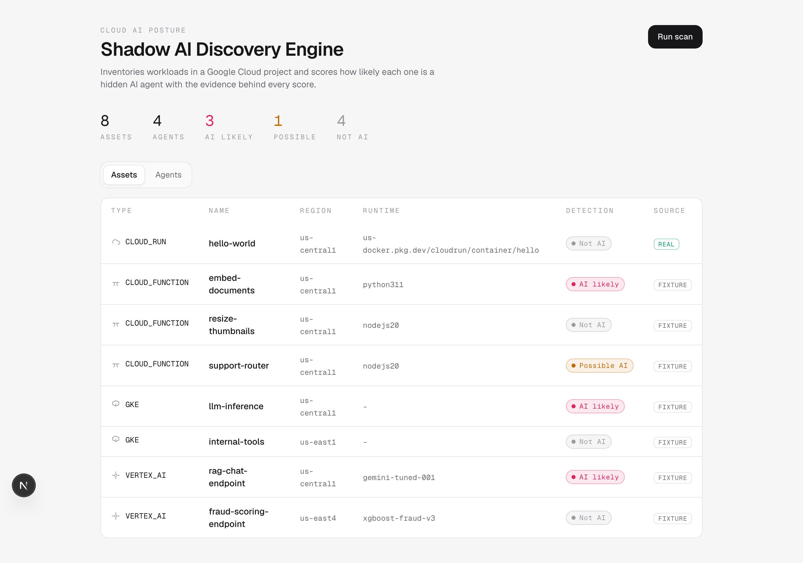
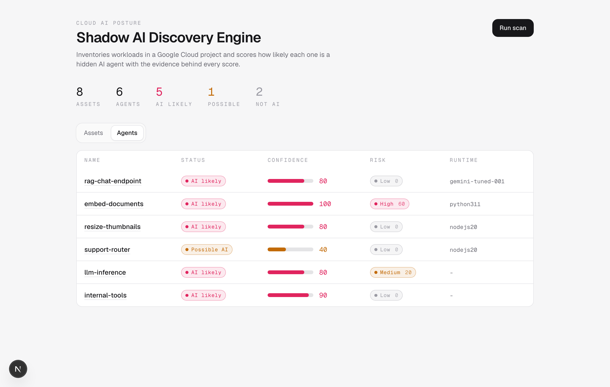
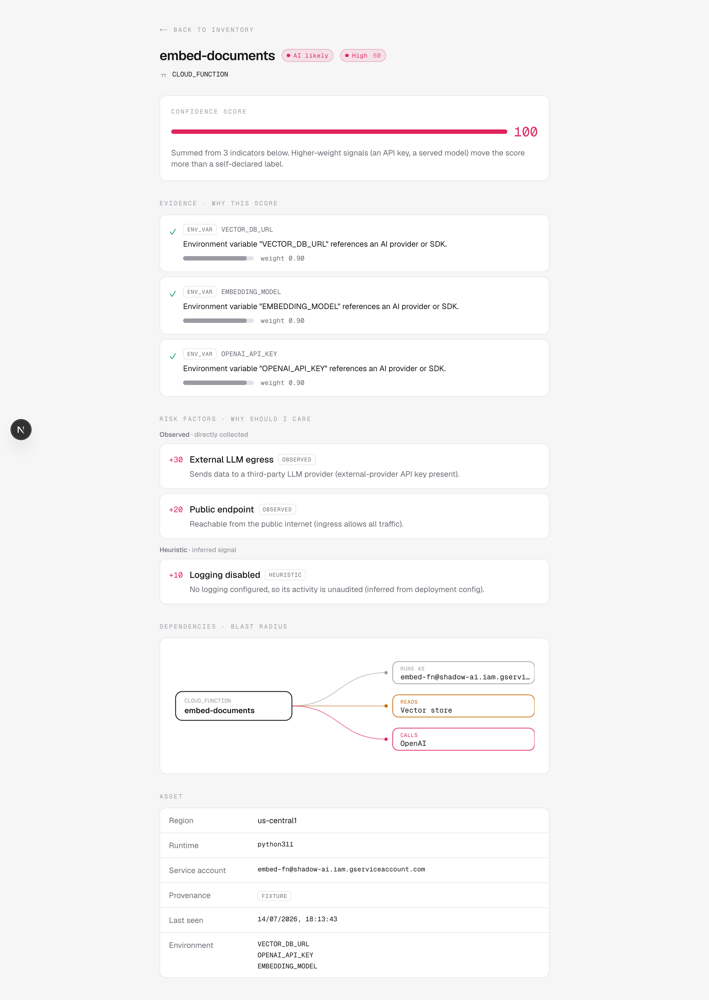

# Shadow AI Discovery Engine

Discover and score the AI workloads hiding in a Google Cloud project.

Teams ship AI agents across cloud infrastructure faster than any central team can
track them. This is a proof-of-concept discovery platform that scans a GCP
project, inventories its workloads, and flags the ones that look like AI agents -
with an **explainable confidence score** that shows *why* each one was flagged.

- **Discovery** - live Cloud Run scanning via the Google Cloud SDK, plus
  representative fixtures for Cloud Functions, GKE, and Vertex AI.
- **Detection** - static, transparent heuristics (API keys, served models, agent
  frameworks, self-declared labels).
- **Scoring** - an additive 0–100 confidence with a `AI_LIKELY` / `POSSIBLE_AI` /
  `NOT_AI` band, and the evidence behind every point.
- **Surfaces** - a REST API and a lightweight dashboard.

> Architecture, design decisions, tradeoffs, and how this scales to thousands of
> projects live in **[`ARCHITECTURE.md`](ARCHITECTURE.md)**.

**Bonuses implemented.**
- **Risk scoring** - a second, orthogonal axis: alongside "is this AI", each asset
  gets an additive risk score (external-LLM egress, public endpoint, broad service
  account, logging) with every factor labelled *observed* or *heuristic*.
  Rule-based, so the other bonuses slot in as new rules.
  See [`ARCHITECTURE.md` §7](ARCHITECTURE.md#7-risk-scoring-architecture).
- **Relationship view** - each agent's detail page shows its dependency chain
  (service account, external LLM, vector store, served model) so you can read the
  blast radius. Derived from collected metadata; no extra discovery.

---

## Screenshots

**Inventory** - every asset with its detection band; `REAL` marks assets
discovered live from Cloud Run.



**Agents** - workloads scored as AI, with both confidence and risk (two axes).



**Agent detail** - the confidence score and the evidence ledger that produced it.



---

## Quickstart

### Prerequisites

- Node.js 20+ and [pnpm](https://pnpm.io)
- A [Neon](https://neon.tech) (or any) Postgres database
- *(Optional)* a GCP service account key to enable live Cloud Run discovery. With
  no GCP credentials, the app runs on fixtures alone.

### Setup

```bash
pnpm install                 # installs deps and runs `prisma generate`
cp .env.example .env         # then fill in the values (see below)
pnpm prisma db push          # create the schema in your database
pnpm dev                     # http://localhost:3000
```

Open the dashboard and click **Run scan**, or trigger it from the API:

```bash
curl -X POST http://localhost:3000/api/scan
# { "assetsDiscovered": 8, "agentsDetected": 4 }
```

### Environment variables

| Variable | Required | Purpose |
| -------- | -------- | ------- |
| `DATABASE_URL` | yes | Pooled Postgres connection (app runtime) |
| `DIRECT_URL` | yes | Direct Postgres connection (Prisma migrations) |
| `GOOGLE_CLOUD_PROJECT` | no | Project to scan. Unset → Cloud Run discovery returns nothing |
| `GOOGLE_APPLICATION_CREDENTIALS` | no | Path to a service account JSON key for live Cloud Run discovery |

See [`.env.example`](.env.example) for the exact format. The `.env` file is
gitignored - no credentials are committed.

---

## REST API

| Method | Path | Description |
| ------ | ---- | ----------- |
| `POST` | `/api/scan` | Run discovery → detection → scoring → persist |
| `GET`  | `/api/assets` | All discovered assets, each with its detection band |
| `GET`  | `/api/agents` | Only assets scored as AI workloads |
| `GET`  | `/api/agents/{id}` | One asset with its detection and full evidence |

Full request/response examples are in
[`docs/api-examples.md`](docs/api-examples.md).

---

## How detection scores work

Detection emits weighted indicators; scoring sums them into a 0–100 confidence.
The score is always just the sum of the reasons shown beside it.

| Indicator | Weight | Example |
| --------- | -----: | ------- |
| `ENV_VAR` | 0.9 | `OPENAI_API_KEY`, `VECTOR_DB_URL` (key names only - never values) |
| `MODEL`   | 0.8 | `gemini`, `vllm`, `text-embedding` |
| `FRAMEWORK` | 0.7 | LangChain, LangGraph, CrewAI |
| `LABEL`   | 0.4 | a self-declared `ai=true` label |

`confidence = min(100, round(Σ weights × 100))` → `≥70 AI_LIKELY`,
`≥40 POSSIBLE_AI`, `<40 NOT_AI`.

A workload with two provider keys reaches 100; one that only self-declares with a
label reaches 40; an `xgboost` model fires nothing and stays `NOT_AI` - classic
ML is intentionally not treated as generative AI.

---

## Project layout

```
app/
  api/            REST routes (scan, assets, agents, agents/[id])
  page.tsx        Dashboard: assets + agents
  agents/[id]/    Agent detail: score + evidence ledger
  ui.tsx          Shared presentational primitives
lib/
  discovery/      Collect cloud resources (live Cloud Run + fixtures)
  normalizer/     Provider payloads → Assets
  detection/      Static AI heuristics → Evidence
  scoring/        Evidence → confidence + status
  persistence/    Prisma queries (store + retrieve)
prisma/schema.prisma
docs/             API examples + screenshots
```

Each `lib/` layer has one responsibility and talks only to the adjacent one - see
[`ARCHITECTURE.md`](ARCHITECTURE.md) for the boundary rules.

---

## Tech stack

Next.js (App Router) · TypeScript · Prisma · Neon Postgres ·
`@google-cloud/run` · Tailwind CSS.

## Scope

A prototype that prioritizes architectural clarity over exhaustive cloud
coverage. Out of scope by design: authentication, background jobs, Cloud Logging
integration, and production error handling.
[`ARCHITECTURE.md`](ARCHITECTURE.md) covers what production would add.
